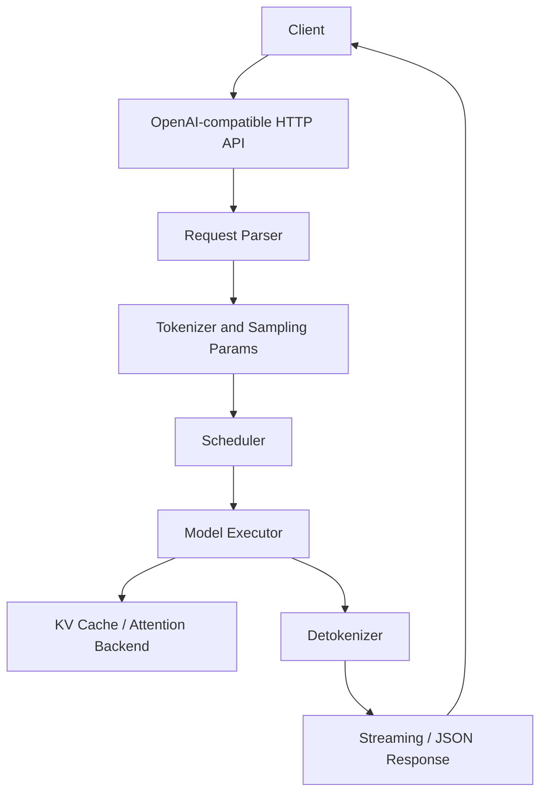

# 00 - 全局认知：SGLang 是什么

SGLang 是面向 LLM / multimodal model 的 serving 与 structured generation 框架。对 rookie 来说，第一阶段不需要一次性理解所有高级能力，而要先抓住一条主线：

```text
Client request
  -> HTTP / OpenAI-compatible API
  -> request parsing
  -> tokenizer / sampling params
  -> scheduler
  -> model executor
  -> KV cache / attention backend
  -> detokenizer / streaming response
```

## 你需要先建立的 4 个问题

### 1. SGLang 在系统中扮演什么角色？

SGLang 位于应用和底层模型执行之间，负责把外部请求变成高效的模型推理任务。它通常提供：

- OpenAI-compatible API server
- native generation API
- batching / scheduling
- token streaming
- KV cache 管理
- structured output / constrained decoding
- 多模型、多硬件后端相关能力

第一版 MVP 只关注：**server、request lifecycle、scheduler、streaming、KV cache**。

### 2. 一次请求为什么不是直接调用 model.generate？

生产级 serving 需要处理很多问题：

- 多个请求同时进入系统
- prompt 长短不同
- 每个请求的 sampling params 不同
- prefill 和 decode 阶段计算特征不同
- token 要边生成边返回
- KV cache 要复用并受显存限制

因此 SGLang 的核心价值不是“能不能生成文本”，而是“如何高效、稳定、可扩展地服务推理请求”。

### 3. Rookie 第一阶段应该看哪些模块？

先按职责看，而不是按文件顺序看：

| 模块 | 你要理解的问题 |
| --- | --- |
| Server / entrypoints | 请求从哪里进入？OpenAI-compatible API 如何映射到内部对象？ |
| Request / sampling params | 用户参数如何被解析、校验和传递？ |
| Tokenizer | prompt 什么时候变成 token ids？ |
| Scheduler | 请求如何排队、组 batch、进入 prefill / decode？ |
| Model executor | 真正的 forward 在哪里发生？ |
| KV cache | 为什么长上下文占显存？prefix reuse 如何影响性能？ |
| Streaming | token 如何逐步返回给 client？ |

### 4. 本项目怎么学？

推荐顺序：

1. 跑通真实 SGLang server。
2. 用 OpenAI-compatible API 发一次请求。
3. 观察 streaming response。
4. 并发发送多条请求，观察 latency。
5. 对照源码地图阅读 SGLang 入口模块。
6. 只做最小 trace，不急着改复杂逻辑。

## MVP 架构图


